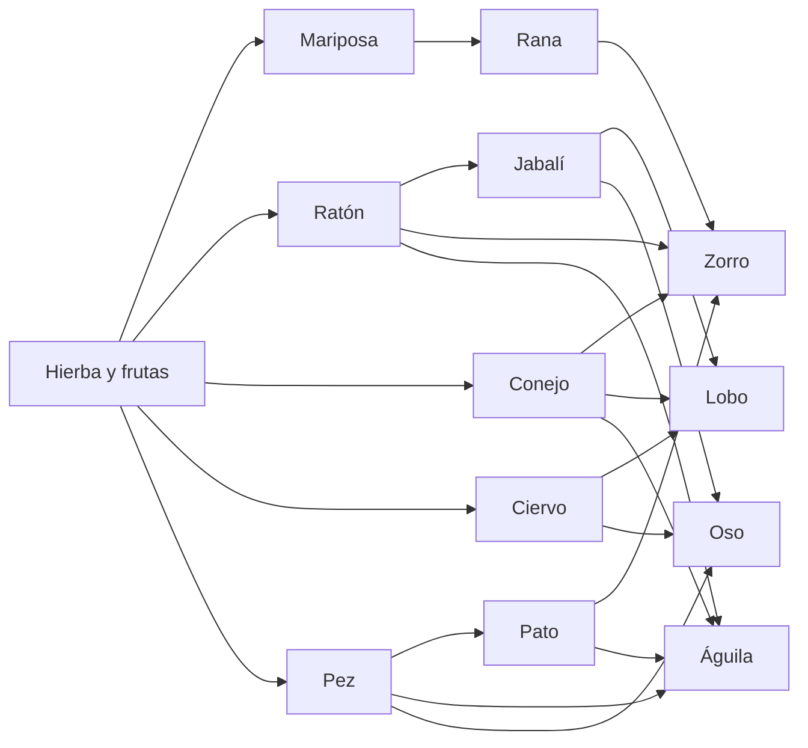
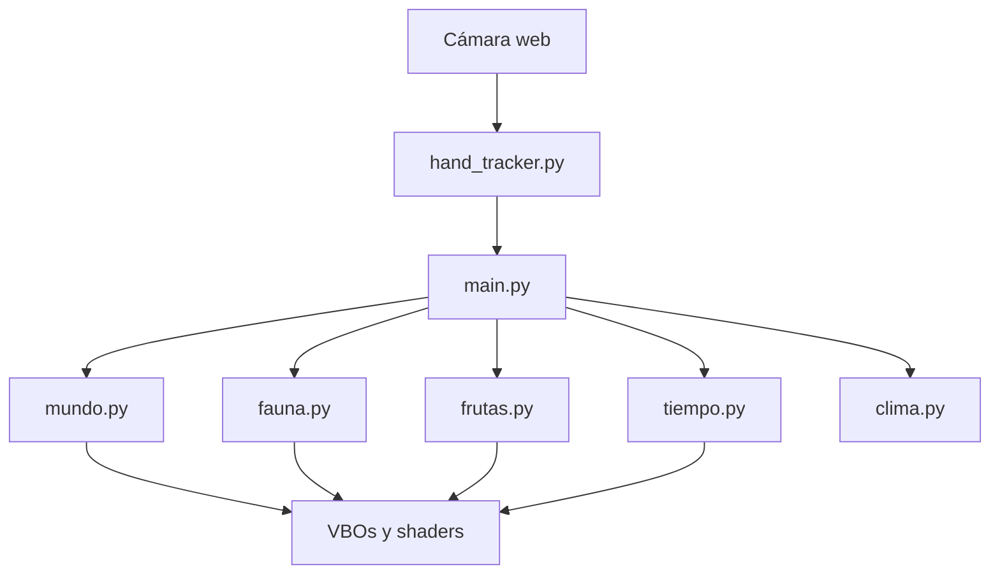

# WordRender3D

Simulador 3D de un ecosistema voxel controlado con las manos. Una cámara web lee las puntas de los dedos; el cielo recorre un ciclo de día y noche; el agua se anima con olas Gerstner; y una cadena alimenticia de doce especies vive, pasta, caza y huye. El clima —brisa, lluvia, tormenta, sequía, nieve o tornado— lo eliges tú.

[](https://www.python.org/)
[](https://www.opengl.org/)
[](#licencia)

## Contenido

- [Requisitos](#requisitos)
- [Instalación](#instalación)
- [Uso](#uso)
- [Controles](#controles)
- [Climas](#climas)
- [Cadena alimenticia](#cadena-alimenticia)
- [Arquitectura](#arquitectura)
- [Rendimiento](#rendimiento)
- [Guardado](#guardado)
- [Documentación](#documentación)
- [Licencia](#licencia)

## Requisitos

| Componente | Detalle |
| --- | --- |
| Sistema | Windows 10/11 (también Linux y macOS) |
| Runtime | Python 3.11 o superior |
| Entrada | Cámara web (opcional: ratón y teclado cubren el mismo flujo) |
| Gráficos | GPU con OpenGL 2.1 o superior |

## Instalación

```powershell
git clone https://github.com/DevCat-HGS/WordRender3D.git
cd WordRender3D
python -m venv .venv
.\.venv\Scripts\Activate.ps1
pip install -r requirements.txt
```

En Linux o macOS:

```bash
python3 -m venv .venv
source .venv/bin/activate
pip install -r requirements.txt
```

La primera ejecución descarga el modelo de manos de MediaPipe (~8 MB) en `modelos/`. Ese archivo no se versiona.

## Uso

```powershell
.\.venv\Scripts\python.exe main.py
```

Se abre una ventana 1280×720. Si hay cámara, el hilo de MediaPipe empieza a leer las manos; si no, el puntero del ratón y el teclado bastan.

## Controles

### Manos

| Mano | Gesto | Acción |
| --- | --- | --- |
| Derecha (puntero) | Punta del índice | Mueve el cursor |
| Derecha | Pellizco pulgar + índice | Lanza el clima elegido o pulsa un botón |
| Derecha | Pellizco pulgar + medio | Vuelve a la brisa |
| Izquierda (cámara) | Pellizco pulgar + índice y mover | Gira el mundo |
| Izquierda | Pellizco pulgar + medio y subir o bajar | Zoom |

Si el modelo cruza las manos, pulsa `M` o el botón **Cambiar manos**.

### Teclado y ratón

| Entrada | Acción |
| --- | --- |
| `1`–`6` | Elige un clima |
| Clic izquierdo | Lanza el clima o pulsa un botón |
| Clic derecho | Vuelve a la brisa |
| Rueda / `RePág` `AvPág` | Zoom |
| Flechas | Órbita de la cámara |
| `N` | Pausa o reanuda el ciclo día/noche |
| `V` / `B` | Mediodía / noche |
| `,` `.` | Más lento / más rápido el cielo |
| `T` | Nuevo terreno y fauna |
| `Z` | Deshacer |
| `C` | Limpiar |
| `G` / `L` | Guardar / cargar |
| `M` | Intercambia las manos |
| `P` | Muestra u oculta la vista de la cámara |
| `H` / `F1` | Ayuda y recuento de especies |
| `Esc` | Salir |

## Climas

La barra inferior no coloca bloques: cambia el tiempo.

| Tecla | Clima | Efecto |
| --- | --- | --- |
| `1` | Brisa | Viento suave y hojas |
| `2` | Lluvia | Cielo gris, lluvia y más frutas |
| `3` | Tormenta | Viento fuerte, rayos y animales asustados |
| `4` | Sequía | Polvo, más hambre y frutas que se secan |
| `5` | Nevado | Nieve, frío y paso más lento |
| `6` | Tornado | Remolino que empuja y hace daño |

La lluvia brota frutas en las copas. La sequía las pudre. El tornado las tira. Los herbívoros las comen.

## Cadena alimenticia

Doce especies, cada una con silueta y andar propios.



Los herbívoros pastan y comen manzanas, naranjas y bayas. Los carnívoros persiguen, pegan y limpian carroña. Las presas huyen. Si se alimentan bien, se reproducen con un tope de población.

El movimiento no teletransporta el rumbo: hay inercia, giro suave, trote, saltos (conejo, rana, ratón), aleteo (mariposa, águila) y nado ondulante (pez). El terreno se pisa con altura interpolada, no con un snap.

## Arquitectura



| Módulo | Responsabilidad |
| --- | --- |
| `main.py` | Ventana, cámara, HUD y bucle |
| `hand_tracker.py` | MediaPipe en un hilo, para no congelar el render |
| `mundo.py` | Voxeles 128×30×128, terreno, raycast y mallas |
| `texturas.py` | Atlas procedural de bloques |
| `shaders.py` | Iluminación, agua Gerstner y fauna |
| `clima.py` | Ciclo de día y noche |
| `tiempo.py` | Climas, partículas y tornado |
| `fauna.py` | IA, locomoción y mallas de animales |
| `frutas.py` | Frutas en los árboles |

## Rendimiento

El terreno solo se vuelve a subir a la GPU cuando cambia. La fauna y las frutas cercanas se empaquetan en una malla dinámica; lo lejano se simula más barato o no se dibuja. El agua corre en el shader. El seguimiento de manos vive en otro hilo.

Dependencias en `requirements.txt`: `mediapipe`, `opencv-python`, `numpy`, `pygame`, `PyOpenGL`.

## Guardado

**Guardar** escribe `mundo_guardado.npy` con la cuadrícula de bloques. Un mundo de otro tamaño no carga. Ese archivo, el entorno virtual, las capturas locales y el modelo de MediaPipe están en `.gitignore`.

## Documentación

Este README es el resumen. La explicación completa está en [`doc/`](doc/README.md):

| Documento | Contenido |
| --- | --- |
| [Inicio](doc/inicio.md) | Primer arranque y fallos comunes |
| [Guía de usuario](doc/guia-de-usuario.md) | Manos, teclado, HUD y flujos |
| [Arquitectura](doc/arquitectura.md) | Módulos, bucle e hilos |
| [Plan de mejora](doc/plan-de-mejora.md) | Deuda, pases A/B/C y fuera de alcance |
| [Visiones](doc/visiones.md) | Laboratorio, patio, acuario y pieza |

## Licencia

Uso personal y educativo. El modelo de manos pertenece a MediaPipe / Google y se descarga en el primer arranque.
