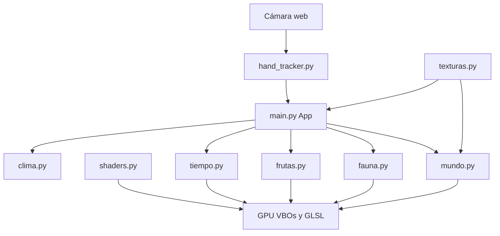

# Arquitectura

WordRender3D es un proceso Python: una ventana pygame+OpenGL, un hilo de cámara y arrays NumPy. No hay servidor, no hay motor comercial, no hay escenas en disco.

## Mapa de módulos

| Archivo | Rol |
| --- | --- |
| `main.py` | Ventana, input, HUD, cámara, bucle, subida a GPU |
| `hand_tracker.py` | MediaPipe en hilo, preview, landmarks |
| `mundo.py` | Grid, terreno, raycast, mallas, altura |
| `texturas.py` | Atlas 4×4 procedural |
| `shaders.py` | Fuentes GLSL y helper `compilar` / `uniforms` |
| `clima.py` | Hora del día → `EstadoCielo` |
| `tiempo.py` | Clima elegido, partículas, tornado |
| `fauna.py` | 12 especies, IA, locomoción, malla |
| `frutas.py` | Frutas en hojas, clima, herbívoros |
| `requirements.txt` | Dependencias pip |
| `modelos/` | `hand_landmarker.task` (descargado) |

### Restos que no entran al bucle

| Ruta | Estado |
| --- | --- |
| `ciclo.py` | Prototipo viejo de día/noche |
| `mundo3d/` | Prototipo viejo de gestos y filtros |

No los borra la documentación: el [plan de mejora](plan-de-mejora.md) propone retirarlos o reabsorberlos.

## Arranque

`App.__init__`:

1. pygame + contexto OpenGL (intenta MSAA 4×; si falla, sin AA).
2. `Mundo()` + `generar_terreno`.
3. `Fauna`, `Frutas`, `Tiempo`.
4. Cámara orbital, hora 0.34 (mañana), campo de estrellas.
5. `HandTracker().start()`.
6. Compila shaders, sube atlas, construye HUD.

## Bucle (`App.run` / frame)

Orden típico de un frame:

1. `dt` acotado (la fauna además recorta a 0.05 s).
2. Eventos pygame → teclas, clics, rueda.
3. Si hay frame nuevo de manos → cursor, órbita, pellizcos.
4. Si el cielo no está en pausa → avanza `hora`, `estado_cielo`, `tiempo.teñir`.
5. `tiempo.actualizar` (partículas, flash, tornado).
6. `fauna.actualizar(dt, cam=ojo, clima=estado)`.
7. `frutas.actualizar(dt, clima, fauna)`.
8. Si `mundo.version` cambió → `construir_mallas` y subida de VBOs estáticos.
9. `fauna.malla_visible` / `frutas.malla_visible` → VBOs dinámicos.
10. Draw 3D + partículas + HUD.
11. `pygame.display.flip()`.

## Hilos y locks

Solo hay dos hilos relevantes:

| Hilo | Trabajo | Comunicación |
| --- | --- | --- |
| Principal | Simulación + render | Lee copias |
| `HandTracker` | Captura + inferencia | `Lock` sobre lista de manos y preview |

El landmarker **no** corre en el hilo de OpenGL. El preview se copia; no se comparte el `ndarray` vivo.

## GPU

`MallaGPU` envuelve VBO. Terreno y agua son estáticos (se resuben al editar). Fauna y frutas son dinámicos (`GL_DYNAMIC_DRAW`, 3 atributos: pos, normal, color).

Uniforms de luz (`u_sun_*`, `u_luna_*`, `u_ambient`) se escriben cada frame. Cambiar el cielo es barato.

## Datos que se persisten

Solo `mundo.grid` en `mundo_guardado.npy`. No se guardan hora, clima, yaw de cámara, fauna ni frutas. Cargar = terreno + vida nueva.

## Decisiones que importan

- **SoA + NumPy** en fauna y partículas: un `for` de ~150 animales, no 150 objetos Python con métodos virtuales.
- **Una malla de fauna**, no 150 draw calls.
- **Culling por distancia** en IA y en mesh.
- **Agua en shader**, no en CPU.
- **Atlas procedural**, cero assets de bloques.
- **GLSL 120**, compatibilidad por encima de PBR.

## Cómo leer el código la primera vez

1. `main.py` docstring y `App.__init__`.
2. `hand_tracker.py` (`Mano`, `run`).
3. `mundo.generar_terreno` y `construir_mallas`.
4. `clima.estado_cielo` y `tiempo.actualizar`.
5. `fauna.actualizar` y `malla_visible`.
6. `shaders.py` fragmento de agua y de sólido.
