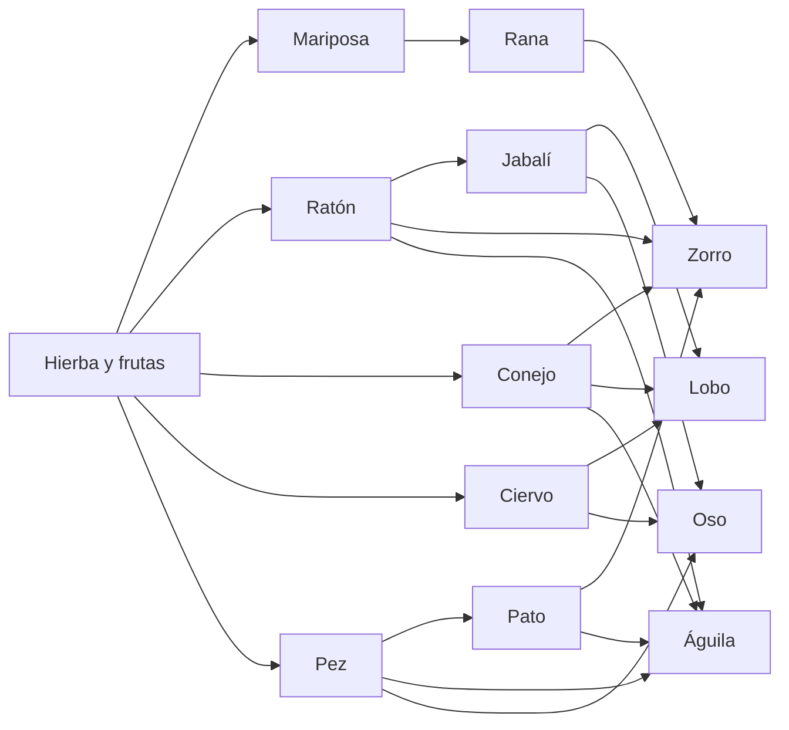

# Ecosistema

Tres capas: **plantas** (pasto y hojas del terreno), **frutas** (`frutas.py`) y **fauna** (`fauna.py`). Nadie las controla. Tú solo cambias el clima y miras.

## Cadena

Dietas en código: `hierba`, `nectar`, `carne`, `omni`.

- Hierba y néctar pastan y comen frutas.
- Carne y omni cazan las `presas` de su especie y limpian carroña.
- Si tu id está en `presas` de un vecino, huyes.

Números exactos: [Referencia](referencia.md#especies).

## Fauna: datos

Todo es Structure of Arrays (NumPy), no una lista de objetos:

`esp`, `pos`, `vel`, `yaw`, `yaw_obj`, `wander_ang`, `hambre`, `vida`, `estado`, `fase`, `cd`, `objetivo`, `vivo`, `rapidez`, `y_suelo`, `salto`.

Estados: `WANDER`, `COMER`, `HUIR`, `CAZAR`, `ATACAR`, `MUERTO`.

Vecinos: hash espacial de celdas 8×8. Cada animal solo mira las 9 celdas alrededor, dentro de su `vision`.

Población inicial ≈ 150. Tope duro 340. Cada especie se reproduce si come bien y no pasa de `poblacion + 6`.

Colocación: peces y patos buscan agua; voladores arrancan a 3.5–6 de altura; el resto evita lagos si no saben nadar.

## IA por frame

1. Hambre sube (más si es carnívoro o hay sequía).
2. Si vida ≤ 0 o hambre > umbral → `MUERTO`. El cadáver dura ~18 s y luego se oculta (`y = -50`).
3. Lejos de la cámara (> 95 u) se actualiza barato: un poco de wander y asentar altura.
4. Cerca: busca depredador, presa o carroña.
5. Tormenta/tornado pueden forzar `HUIR`.
6. Caza: persigue; a 0.55 + escala pega (`dano`) con cooldown 0.45 s.
7. Carroña: se come y baja 12 de hambre.
8. Hierba/néctar/omni con hambre: `COMER`, pastan, a veces dan un paso o miran a los lados.
9. Si no: wander de Reynolds (círculo delante + ángulo que deriva) y pausas para olfatear.

## Locomoción

El rumbo no salta al ángulo objetivo.

| Pieza | Qué hace |
| --- | --- |
| Inercia | La velocidad se acerca a la deseada (`accel` 3.2, o 5.5 si huye) |
| Yaw | Lerp circular (`_lerp_ang`) a ~7 rad/s |
| Altura | `_asentar` interpola hacia suelo, agua u oleaje de vuelo |
| Trote | Bob y roll en la malla, proporcionales a `rapidez` |
| Salto | Rana, conejo y ratón: impulso + arco vertical (`salto`) |
| Vuelo | Altura ondulante; bob de aleteo |
| Pez | Seno bajo el agua; en seco se queda casi en el fondo |

El frío del nieve multiplica la velocidad objetivo por 0.62. El viento del clima empuja a todos los vivos.

## Malla de animales

Cada especie tiene un modelo low-poly distinto (cajas: orejas, cola, pico, cuernos, alas). `malla_visible` junta solo los que están a &lt; 90 u de la cámara, los rota por yaw, aplica bob/roll y los sube a **un** VBO dinámico. Los muertos se achican y se oscurecen.

## Frutas

Hasta ~70 al nacer (manzana, naranja, baya) colgando de celdas `HOJAS`. Modelo: octaedro de radio 0.16.

| Clima | Efecto |
| --- | --- |
| Lluvia o tormenta | Brota una fruta nueva |
| Sequía | Se pudre alguna |
| Tornado | Caen si están cerca del remolino |

Tope ~160; recicla las muertas. Un herbívoro o omnívoro con hambre ≥ 4 que se acerque a 0.85 u se come la más cercana (−9 de hambre).

Al cargar o regenerar terreno se vuelven a poblar. El guardado **no** serializa frutas ni animales.
